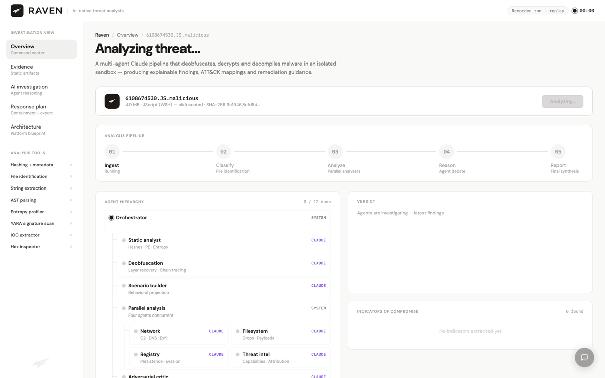
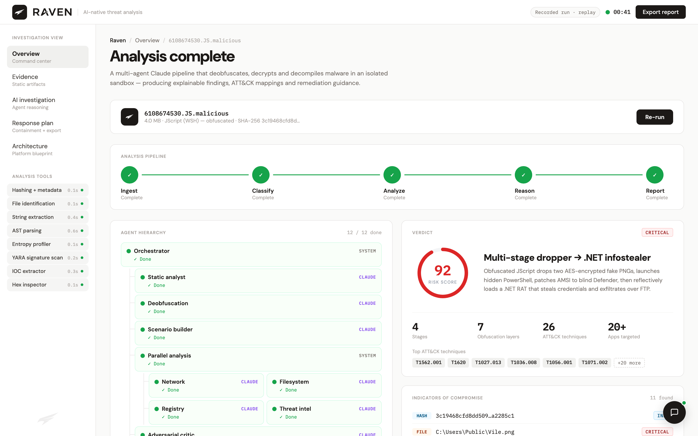
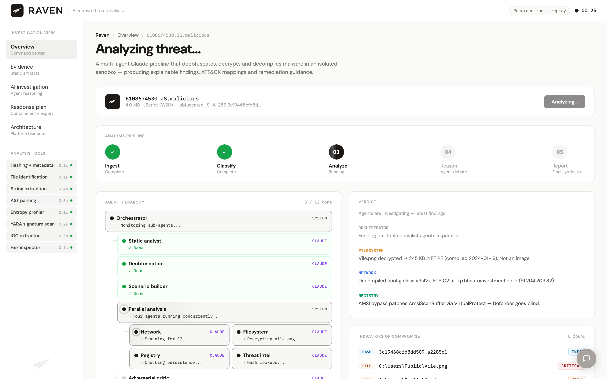
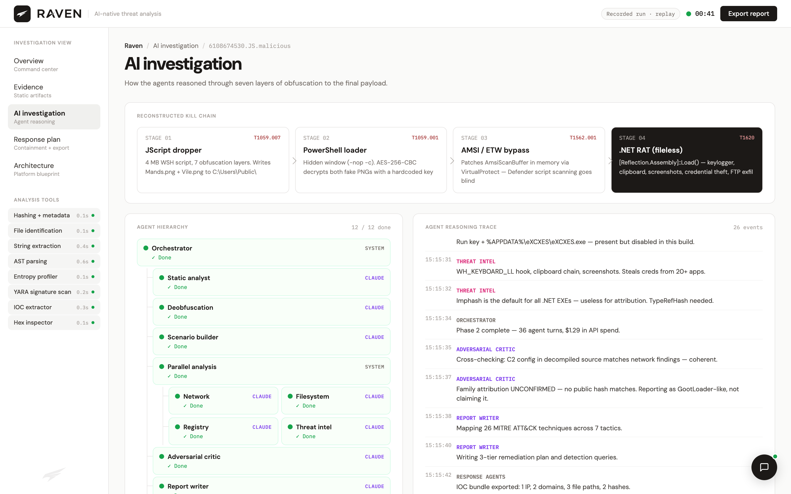
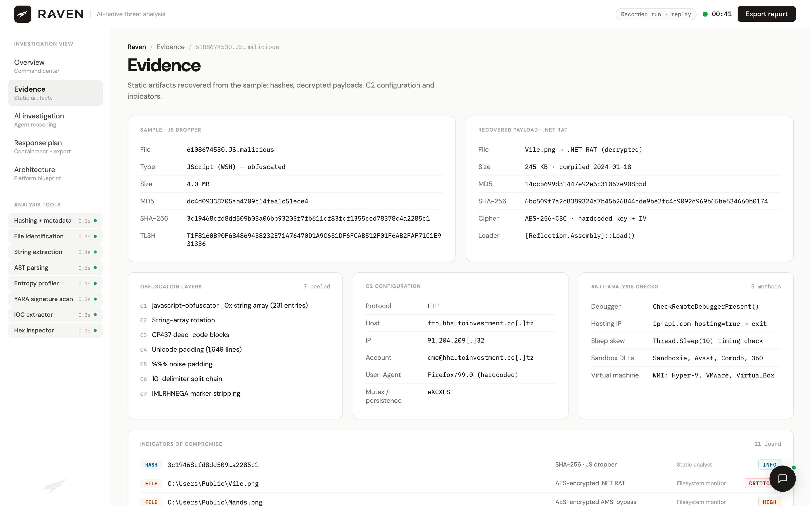
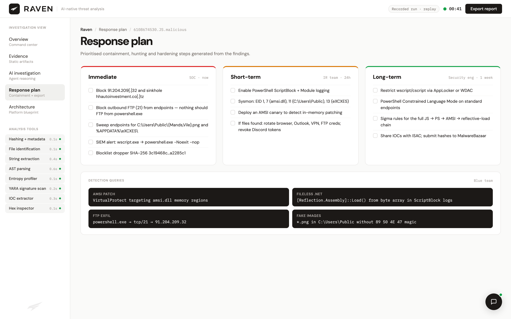
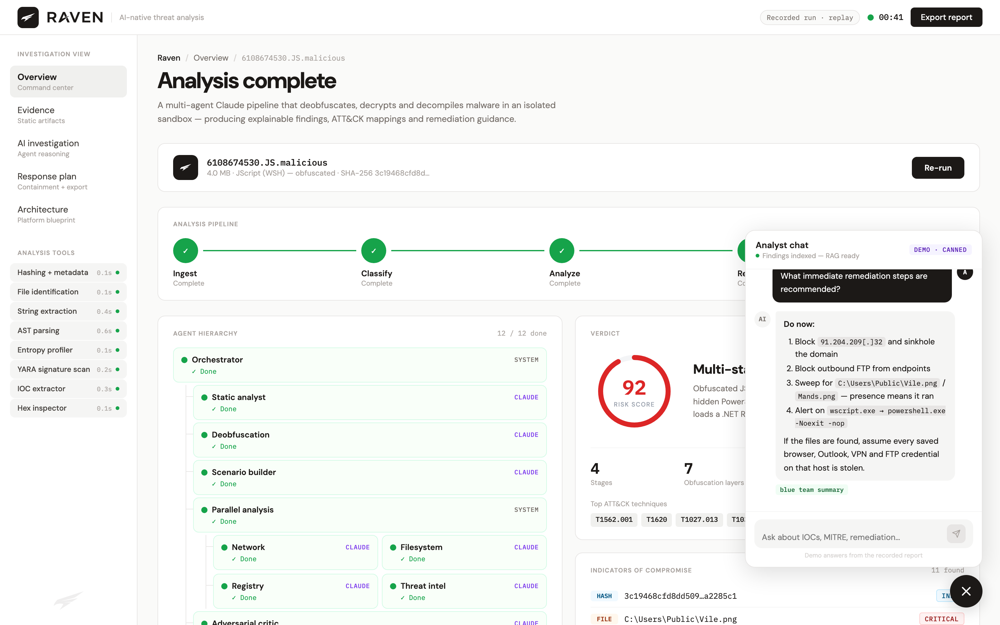
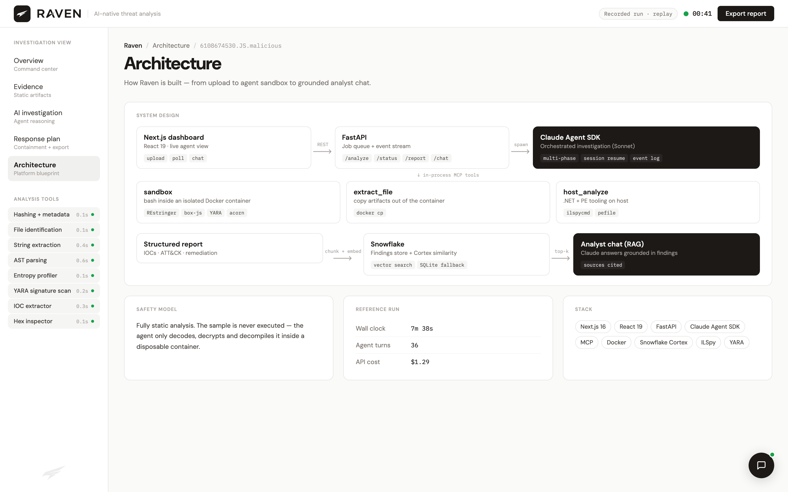

<div align="center">

# Raven

**A multi-agent Claude pipeline that reverse-engineers malware — and shows its work.**

Drop in a sample. A team of AI agents deobfuscates, decrypts and decompiles it inside an isolated sandbox, then hands back IOCs, a MITRE ATT&CK map, a remediation plan, and an analyst chat grounded in the findings.

Built at **HackUSF 2026**.



</div>

---

## What it found

The reference run analyses a real-world sample, `6108674530.JS.malicious` — a 4 MB obfuscated JScript file. In **7m 38s and $1.29 of API spend**, the agents:

- Peeled **7 layers of obfuscation** (string-array rotation, Unicode padding, marker stripping…)
- Recovered a **hardcoded AES-256-CBC key** and decrypted two payloads disguised as `.png` files
- Decompiled the final **.NET infostealer** and extracted its FTP C2 config and credential-theft targets
- Mapped **26 ATT&CK techniques** and produced a tiered SOC / IR / engineering response plan

The full agent-written report is in [`malware_analysis_report.md`](malware_analysis_report.md).

```
JScript dropper ──▶ hidden PowerShell ──▶ AMSI bypass ──▶ fileless .NET RAT ──▶ FTP exfil
   (7 layers)        (AES-256 decrypt)    (Defender off)   (keylog, creds, screens)
```

## Screenshots

| | |
|---|---|
|  **Command center** — live pipeline, agent tree, verdict and IOCs |  **Mid-run** — four specialist agents working in parallel |
|  **AI investigation** — kill chain, reasoning trace, ATT&CK matrix |  **Evidence** — hashes, decrypted payload, C2 config, anti-analysis checks |
|  **Response plan** — immediate / 24h / 1-week actions + detection queries |  **Analyst chat** — RAG over the findings, with cited sources |



## How it works

```
Next.js dashboard ──REST──▶ FastAPI ──spawn──▶ Claude Agent SDK (orchestrated, multi-phase)
                              │                        │
                              │              in-process MCP tools
                              │       ┌────────────────┼─────────────────┐
                              │    sandbox        extract_file      host_analyze
                              │  (Docker: REstringer, (docker cp)   (ilspycmd, pefile)
                              │   box-js, YARA, acorn)
                              ▼
                     Structured report ──chunk+embed──▶ Snowflake (Cortex similarity)
                                                              │ top-k
                                                              ▼
                                                    Claude analyst chat (RAG)
```

- **Agent pipeline** — `fallback_pipeline.py` drives Claude through triage → deobfuscation → payload recovery → decompilation, resuming the same session across phases. Every tool call and reasoning step is streamed to `workspace/pipeline_events.jsonl`.
- **Sandboxed tools** — the agent never touches the host directly. It runs bash inside a disposable Docker container, copies artifacts out explicitly, and uses host-side .NET tooling only for decompilation.
- **API** — `api_server.py` (FastAPI) queues jobs, exposes an incremental event stream for the live UI, and turns findings into a structured report.
- **RAG chat** — findings are chunked by type (C2, MITRE, capability, hunt query…) and stored in Snowflake; questions are answered by Claude using Cortex similarity search, with a local SQLite fallback.
- **Safety** — analysis is fully static. The sample is decoded, decrypted and decompiled, never executed.

## Run it

### Demo (frontend only, no keys needed)

```bash
cd frontend
npm install
npm run dev
```

Open <http://localhost:3000> and click **Replay recorded analysis**. The dashboard replays the real recorded run against the bundled report.

| URL | Shows |
|---|---|
| `/?demo=1` | Auto-plays the replay (~40s) |
| `/?demo=done` | Jumps straight to the finished analysis |
| `/?demo=done&view=investigation` | Opens a specific tab (`evidence`, `investigation`, `response`, `architecture`) |

### Full pipeline

Requires Python 3.10+, Docker, the .NET 8 SDK with `ilspycmd`, an Anthropic API key, and (optionally) a Snowflake account.

```bash
python -m venv .venv && .venv/bin/pip install -r requirements.txt
7z x -pinfected -oworkspace samples/6108674530.JS.malicious.zip   # live malware, password: infected
docker run -d --name malware-sandbox <your-analysis-image>   # with REstringer, box-js, YARA, node
cp snowflake_chat_integration/.env.example snowflake_chat_integration/.env  # then fill in keys
./start.sh   # backend :8001 + frontend :3000
```

Environment variables: `ANTHROPIC_API_KEY`, and for Snowflake `SNOWFLAKE_ACCOUNT`, `SNOWFLAKE_USER`, `SNOWFLAKE_PRIVATE_KEY_PATH` (or `SNOWFLAKE_PASSWORD`), `SNOWFLAKE_WAREHOUSE`, `SNOWFLAKE_DATABASE`, `SNOWFLAKE_SCHEMA`. Without Snowflake the chat falls back to local SQLite keyword search.

## Project structure

```
api_server.py                 FastAPI — /analyze, /status, /report, /chat
fallback_pipeline.py          Claude Agent SDK investigation + MCP tools
snowflake_chat_integration/   RAG chat: chunking, Snowflake storage, chat router
frontend/                     Next.js 16 / React 19 dashboard
  app/components/
    dashboard_raven.jsx       Main dashboard, live polling + demo replay
    views.jsx                 Evidence, investigation, response, architecture views
    demoData.js               Recorded run, condensed for replay
    ChatPanel.jsx             Floating analyst chat
samples/                      Reference sample, zipped (password: infected)
workspace/pipeline_events.jsonl   Event log from the reference run
malware_analysis_report.md    Full report produced by the agents
```

## Stack

Claude Agent SDK · MCP · FastAPI · Next.js 16 · React 19 · Docker · Snowflake Cortex · ILSpy · REstringer · box-js · YARA

## ⚠️ Disclaimer

`samples/` contains a live malware sample, stored as a password-protected zip (password `infected`, the industry convention) for research and education. Indicators in the UI are defanged. Do not execute any sample outside an isolated analysis environment.
